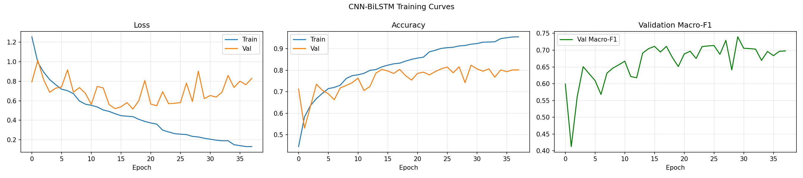
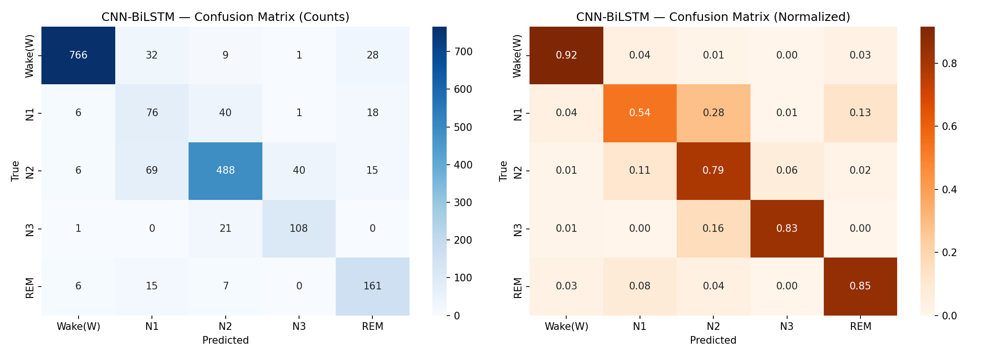

# Deep Learning-Based Sleep Stage Classification Using Single-Channel EOG-R Signal

  
  
  
  

An automated end-to-end deep learning framework built using **PyTorch** to automatically classify 5 distinct sleep stages (Wake, N1, N2, N3, REM) utilizing a single-channel Right Electrooculography (EOG-R) signal extracted from the MESA Sleep Dataset. By replacing intrusive, multi-channel EEG setups with a single EOG channel, this project presents a highly patient-friendly approach suitable for clinical and home-based sleep monitoring.

---

## Repository Structure & Notebooks

The production pipeline is split into two clean Jupyter Notebooks located in the `notebooks/` directory:

1. **`1_EDA_and_Data_Exploration.ipynb`**: Handles the initial Exploratory Data Analysis, verifying signal sampling configurations (256 Hz), extracting raw `EOG-R` channel waveforms using `MNE-Python`, and exploring initial expert annotation distributions (`.xml`).
2. **`2_Sleep_Stage_Classification.ipynb`**: Houses the core deep learning training and evaluation pipeline. It benchmarks a standard 1D CNN against a hybrid **1D CNN + Bidirectional LSTM** model, incorporating bandpass filtering (0.3–35 Hz), subject-wise Z-score normalization, and balanced signal augmentation.

---

## Model Architectures

### 1. Baseline Model: 1D CNN (`BaselineCNN`)
A standard 3-layer 1D Convolutional network acting as a baseline feature extractor, using global adaptive average pooling and a dense classification head to establish early benchmarks.

### 2. Main Model: Hybrid CNN-BiLSTM (`CNN_BiLSTM`)
A custom hybrid architecture optimized for both localized spatial signal burst extractions and macro-temporal sleep transitions:
* **1D CNN Block:** 3 Convolutional layers (Channels: $64 \rightarrow 128 \rightarrow 256$, Kernels: $7 \rightarrow 5 \rightarrow 3$) equipped with Batch Normalization, ReLU activations, and Max Pooling ($4\times$) to capture instantaneous waveforms and burst movements.
* **Recurrent Block:** 2 stacked Bidirectional LSTM layers (256 input features, 128 hidden units, 0.3 dropout) to trace chronological stage dependencies across forward and backward contexts.
* **Classification Head:** Linear projection layers with a 0.4 Dropout factor outputting Logits for the 5 target stages.

---

## Experimental Results & Benchmarks

Both architectures were trained using an Adam optimizer over 40 epochs with a `ReduceLROnPlateau` scheduler. Thanks to a signal-level balanced augmentation strategy (expanding training configurations to 19,490 perfectly balanced epochs), the hybrid architecture delivered a **+10.3% relative improvement** in Macro $F_1$-score over the baseline:

| Architecture | Test Accuracy | Test Macro $F_1$-Score | Status | Saved Weights Artifact |
| :--- | :---: | :---: | :---: | :---: |
| **Baseline 1D CNN** | 77.27% | 0.6860 | Benchmarked | `best_baseline_cnn.pt` |
| **Proposed CNN-BiLSTM** | **83.54%** | **0.7563** | **Optimal** | `best_cnn_bilstm.pt` |

### 1. Performance Visualizations (CNN-BiLSTM)
*The optimization curves showing Loss and Accuracy over 38 epochs until Early Stopping criteria met:*

  

### 2. Confusion Matrix Evaluation
*The matrix highlights high classification alignment across majority sleep states (Wake, N2, REM), while displaying expected transitional ambiguities within unstable phases (such as N1).*

  

